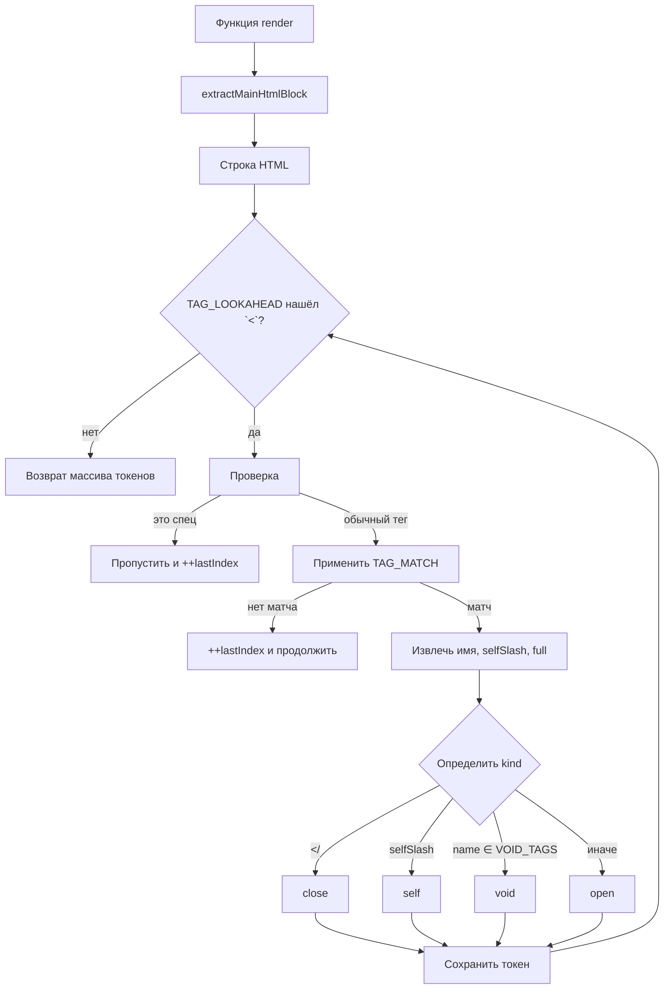

# HTML Tag Scanner for Template HTML

> Мини-библиотека для извлечения **основного HTML-блока** из render-функции и сканирования по нему **тегов** с позициями и типами.

## Зачем это нужно

- Имеем render-функции вида `({ html, context }) => html\`<div>...</div>\``.
- Нужно **не исполнять** JS-выражения из `${...}`, а получить **строку HTML** и пробежать по ней, выделив теги.
- Из полученной строки хотим быстро получить **последовательность токенов-тегов**: имя тега, тип (`open|close|self|void`) и позицию в строке.

## Экспортируемое API

### Типы

```ts
export type Content = Record<string, string | number | boolean | null | Array<string | number | boolean | null>>
export type Core = Record<string, any>
export type State = string

export type Render<C extends Content = Content, I extends Core = Core, S extends State = State> = (args: {
  html: (strings: TemplateStringsArray, ...values: any[]) => string
  core: I
  context: C
  state: State
}) => void

export type TagKind = "open" | "close" | "self" | "void"
export type TagToken = { text: string; index: number; name: string; kind: TagKind }
```

### Функции

```ts
/** Возвращает основной HTML-блок из render-функции как строку */
export function extractMainHtmlBlock<C = Content, I = Core, S = State>(render: Render<C, I, S>): string

/** Сканирует строку HTML и возвращает список токенов тегов */
export function scanHtmlTags(html: string): TagToken[]
```

## Поведение (по тестам)

- Поддерживаются:
  - Простые пары тегов и вложенность: `<div></div>`, `<div><p>..</p></div>`.
  - **Самозакрывающиеся** теги `<br />`, ``, `<input disabled />` → `kind: "self"`.
  - **Void-теги** (напр. `br`, `img`, `input` и др.). Без `/>` такие теги помечаются как `kind: "void"`.
  - **Пространства имён**: `<svg:use ...></svg:use>` → `name: "svg:use"`.
  - Угловые скобки **внутри значений атрибутов** (не ломают парс): `<div title="a > b, c < d">...</div>`.
  - Встраивания через `${ ... html\`<tag>...\` ... }`, тернарники и `map()` с вложенными шаблонами.
- Игнорируются: Processing Instructions (`<?xml ...?>`), HTML-комментарии (`<!-- ... -->`) и `<!DOCTYPE ...>`.
- В каждом `TagToken`:
  - `text` — точный сырой текст тега.
  - `index` — позиция начала тега в исходной строке.
  - `name` — имя тега (в нижнем регистре), с учётом пространства имён.
  - `kind` — `"open" | "close" | "self" | "void"`.

## Примеры

### Базовый

```ts
import { extractMainHtmlBlock, scanHtmlTags } from "./index"

const html = extractMainHtmlBlock(({ html }) => html`<div></div>`)
const tags = scanHtmlTags(html)
// => [ { text: "<div>", index: 0, name: "div", kind: "open" },
//      { text: "</div>", index: 5, name: "div", kind: "close" } ]
```

### Вложенность, соседние узлы и self-теги

```ts
const html = extractMainHtmlBlock(
  ({ html }) => html`
    <div>
      <br />
      
      <input disabled />
    </div>
  `
)
const tags = scanHtmlTags(html)
// => "<div>" (open), "<br />" (self), "" (self), "<input ... />" (self), "</div>" (close)
```

### Namespace-теги

```ts
const html = extractMainHtmlBlock(({ html }) => html`<svg:use xlink:href="#id"></svg:use>`)
const tags = scanHtmlTags(html)
// => "<svg:use ...>" (open), "</svg:use>" (close)
```

### Условия и вложенные шаблоны

```ts
const html = extractMainHtmlBlock<{ list: string[] }>(
  ({ html, context }) => html`
    <ul>
      ${context.list.map((_, i) => html` <li>${i % 2 ? html`<em>A</em>` : html`<strong>B</strong>`}</li> `)}
    </ul>
  `
)
const tags = scanHtmlTags(html)
// => корректная последовательность для <ul>, <li>, <em>/<strong> и т.д.
```

## Ограничения и договорённости

- Задача библиотеки — **сканирование тегов**. Она **не** строит полноценное AST-дерево узлов (текст/узлы/атрибуты).
- JS-выражения внутри `${...}` **не вычисляются**; важен итоговый собранный **сырой HTML-текст**.
- Для корректной работы `extractMainHtmlBlock` ожидается, что HTML собирается **через переданный `html` тег** (шаблонные литералы `html\`...\``).

---

Если нужно — добавлю раздел про список поддерживаемых **void-тегов** и формальный разбор регулярного выражения сканера.

## Поддерживаемые void‑теги

Следующие теги считаются **void** (не имеют закрывающего тега) и помечаются `kind: "void"` при отсутствии `/>`:

```
area, base, br, col, embed, hr, img, input, link, meta, param, source, track, wbr
```

> Если тот же тег встречается в самозакрывающемся виде (``), он маркируется как `kind: "self"`.

## Почему два регулярных выражения?

Внутри `index.ts` используются два регекспа:

- **`TAG_LOOKAHEAD`** — лёгкий **поисковый** шаблон с позитивным просмотром вперёд `(?=...)`.

  - Цель: быстро найти **возможные начала** тегов в строке, не разбирая их полностью.
  - Он устойчив к шуму (атрибуты, кавычки, пробелы), не захватывает текст и не строит большой матч.
  - Мы двигаем `lastIndex` стримингово, поэтому проход по строке линейный.

- **`TAG_MATCH`** — точный **парсер** тега с извлечением имени и флага самозакрытия.
  - Цель: на уже найденной позиции **строго** распарсить один тег целиком, получить:
    - `name` (`[A-Za-z][A-Za-z0-9:-]*`, в т.ч. `svg:use`),
    - `selfSlash` — присутствие завершающего `/` перед `>`,
    - оригинальный текст тега `full` для `text`.

Такое разделение даёт баланс: быстрый курсор по строке + точный разбор только там, где действительно есть тег.

## Алгоритм (в общих чертах)

1. **Извлекаем сырой HTML** из `render` через `extractMainHtmlBlock`:
   - Приводим функцию к строке, находим первый `html\`` и последний обратный апостроф, берём подстроку между ними.
2. **Идём по строке** с помощью `TAG_LOOKAHEAD` (режим `g`):
   - Для каждого срабатывания получаем индекс возможного тега `localIndex`.
   - Если следующий символ после `<` — `!` или `?`, **пропускаем** (комментарии, `<!DOCTYPE ...>`, PI).
3. **Применяем `TAG_MATCH`** к срезу `input.slice(localIndex)`:
   - Если матч не удался — сдвигаем курсор на 1 символ и продолжаем.
   - Если удался — извлекаем `full`, `name`, `selfSlash`.
4. **Определяем вид тега (`kind`)**:
   - начинается с `</` → **`"close"`**
   - есть `selfSlash` → **`"self"`**
   - имя в `VOID_TAGS` → **`"void"`**
   - иначе → **`"open"`**
5. **Записываем токен** `{ text: full, index: offset + localIndex, name, kind }` и двигаем `lastIndex` вперёд.
6. После прохода возвращаем массив токенов.

### Сложность

- Проход по входной строке **линейный** относительно длины (`O(n)`), без бэктрекинга на большие участки.
- Память — пропорциональна количеству найденных тегов.

### Ограничения

- Парсер **не** строит дерево и **не** валидирует корректность вложенности/закрытий.
- Конструкции вида `<script>...</script>` с сырым `<` внутри строк/комментариев JavaScript не поддерживаются полноценно — задача за пределами сканера.
- Внутренности `${...}` **не исполняются**; мы работаем с уже собранной строкой шаблона.

## Диаграмма потока (Flow)



## Краевые кейсы (из тестов)

- `<div title="a > b, c < d">x</div>` → не ломается на `>` или `<` внутри кавычек.
- `<?xml version="1.0"?>` → пропускается (не тег).
- `<!-- comment -->` → пропускается.
- `<!DOCTYPE html>` → пропускается.
- `<br>` → `kind: "void"`.
- `<br />` → `kind: "self"`.
- `<svg:use xlink:href="#id"></svg:use>` → корректно работает namespace.
- `${context.list.map(i => html`<li>${i}</li>`}` → вложенные шаблоны обрабатываются как часть HTML.

## Диаграмма потока

```mermaid
flowchart TD
    A[render-функция] --> B{extractMainHtmlBlock}
    B -->|toString + slice по `html`| C[сырой HTML]
    C --> D{TAG_LOOKAHEAD на '<'}
    D -->|не тег: '!' или '?'| D1[пропуск <!-- -->, <!DOCTYPE>, <?...?>] --> D
    D -->|кандидат| E[TAG_MATCH на подстроке]
    E -->|неудача| F[сдвиг на 1 символ] --> D
    E -->|успех| G[извлечь name/self/full]
    G --> H{определить kind}
    H -->|startsWith('</')| H1[close]
    H -->|selfSlash| H2[self]
    H -->|name ∈ VOID| H3[void]
    H -->|иначе| H4[open]
    H1 --> I[записать токен + index]
    H2 --> I
    H3 --> I
    H4 --> I
    I --> D
    D -->|конец строки| J[возврат массива токенов]
```

## Краевые кейсы (из тестов)

- **Namespace-тег**  
  Вход:

  ```html
  <svg:use xlink:href="#id"></svg:use>
  ```

  Результат: `open(svg:use)`, `close(svg:use)`.

- **Кавычки в атрибутах**  
  Вход:

  ```html
  <a href="https://e.co" target="_blank">x</a>
  <div title="a > b, c < d"></div>
  ```

  Результат: `>`, `<` внутри значений **не** ломают сканирование.

- **Вложенность и self/void**  
  Вход:

  ```html
  <div>
    <br />
    
    <input disabled />
  </div>
  ```

  Результат: `open(div)`, `self(br)`, `self(img)`, `self(input)`, `close(div)`.

- **Условия с внутренними шаблонами**  
  Вход (сокращено):

  ```ts
  html`<div>${context.cond ? html`<em>A</em>` : html`<span>b</span>`}</div>`
  ```

  Результат: корректная последовательность для `<div>`, затем `<em>` **или** `<span>`.

- **map + условия**  
  Вход (сокращено):

  ```ts
  html`<ul>
    ${context.list.map((_, i) => html` <li>${i % 2 ? html`<em>A</em>` : html`<strong>B</strong>`}</li> `)}
  </ul>`
  ```

  Результат: корректные теги для `<ul>`, `<li>`, и вложенных `<em>/<strong>`.

- **Операторы сравнения без тегов**  
  Вход:

  ```ts
  ${context.a < context.b && context.c > context.d ? "1" : "0"}
  ```

  Результат: **ничего не матчит** (нет `<tag>`), сравнения игнорируются.

- **Шум и недопустимые имена**  
  Вход (сокращено):

  ```html
  <di*v>bad</di*v>
  <1a> ... </1a>
  <-x>no</-x>
  <good-tag/>÷
  ```

  Результат: `di*v`, `1a`, `-x` **не считаются тегами**; `<good-tag/>` → `self(good-tag)`.

- **PI/комментарии/doctype**  
  Вход:

  ```html
  <?xml version="1.0"?>
  <!-- comment -->
  <!DOCTYPE html>
  ```

  Результат: все три **пропускаются**.
